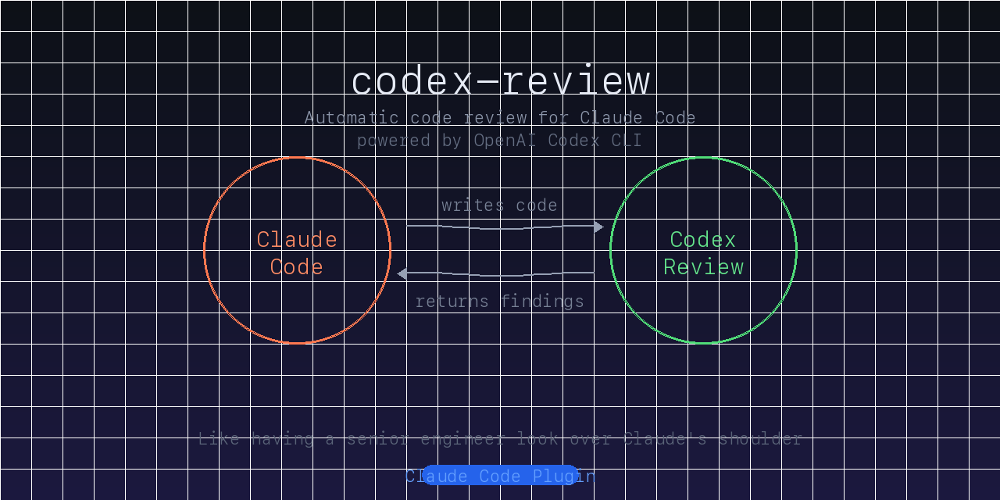

# codex-review



**Automatic code review for Claude Code, powered by OpenAI Codex CLI.**

Every time Claude writes a plan or changes code, Codex reviews it as a second opinion — like having a senior engineer look over Claude's shoulder.

## What it does

- **Detects file changes** — Hooks into Claude Code's Write/Edit events
- **Tracks pending reviews** — Knows what's been reviewed and what hasn't
- **Auto-triggers Codex** — Tells Claude to run Codex review immediately
- **Blocks premature exit** — Circuit breaker prevents stopping with unreviewed changes
- **Two review modes** — Plan review (strategy) and implementation review (code)

## What's New in v2

- **Multi-round reviews** — When you fix issues and re-review, Codex sees the previous findings and verifies they were addressed
- **PR review mode** — Review pull requests with `gh pr diff` via `/codex-review`
- **Review history** — Previous findings stored durably in `.claude/reviews/` (not just `/tmp`)
- **Summary preview** — Hook shows the first 3 lines of Codex findings in context, so Claude sees the headline immediately
- **Configurable model** — Set `"model": "o3"` in `.codex-review.json` to control which model Codex uses

## How it works

```
You write code with Claude Code
        |
        v
Hook detects file changes ───> Marks review as pending
        |
        v
Claude runs: codex exec --full-auto "Review these changes..."
        |
        v
Codex reviews independently ───> Returns findings
        |
        v
Claude evaluates findings ───> Fixes issues or explains why not
        |
        v
Review cleared ───> You can continue or exit
```

## Prerequisites

1. **Claude Code** — [Install Claude Code](https://claude.ai/code)
2. **Codex CLI** — OpenAI's coding agent

```bash
npm install -g @openai/codex
```

3. **OpenAI API key** — Set in your environment

```bash
export OPENAI_API_KEY=sk-...
```

## Installation

```bash
# Add this marketplace
/plugin marketplace add https://github.com/hugotomita1201/codex-review

# Install the plugin
/plugin install codex-review
```

Or manually clone into your plugins directory:

```bash
git clone https://github.com/hugotomita1201/codex-review ~/.claude/plugins/codex-review
```

## Usage

### Automatic (default)

Just code normally. When you change files, the hook will:

1. Detect the change
2. Classify it (plan vs code)
3. Tell Claude to run a Codex review
4. Claude runs `codex exec` with the appropriate review prompt
5. Claude reads the output and addresses findings

### Manual

Type `/codex-review` in Claude Code to trigger a review manually.

### Skip review

Say **"skip codex"** in your message to bypass the review gate for the current task.

## Configuration

Create `.codex-review.json` in your project root to customize behavior:

```json
{
  "planPaths": [".claude/plans/"],
  "ignorePaths": [".claude/", ".git/", "node_modules/", "dist/"],
  "codeExtensions": [".js", ".jsx", ".ts", ".tsx", ".py", ".go", ".rs"],
  "promptPaths": ["/prompts/"],
  "timeout": 120,
  "autoReview": true,
  "circuitBreaker": true,
  "model": "o3"
}
```

All fields are optional — sensible defaults are used for anything not specified.

| Field | Default | Description |
|-------|---------|-------------|
| `planPaths` | `[".claude/plans/"]` | Directories containing plan files |
| `ignorePaths` | `[".claude/", ".git/", "node_modules/", ...]` | Paths to ignore |
| `codeExtensions` | 30+ extensions | File extensions to track |
| `promptPaths` | `["/prompts/"]` | Paths containing prompt files (treated as code) |
| `timeout` | `120` | Codex execution timeout in seconds |
| `autoReview` | `true` | Automatically trigger reviews on file changes |
| `circuitBreaker` | `true` | Block session exit if review pending |
| `model` | *(Codex default)* | Override which model Codex uses (e.g. `"o3"`) |

## Review modes

### Plan review

Triggered when files in `.claude/plans/` change. Codex checks for:
- Wrong assumptions
- Missing edge cases
- Integration gaps
- Operational risks

### Implementation review

Triggered when code files change. Two strategies:

- **5 or fewer files** — Targeted review: Codex reads current file content directly
- **More than 5 files** — Scoped diff: Codex reviews `git diff` output

Codex checks for:
- Correctness bugs
- Integration mismatches
- Race conditions
- Error handling gaps
- Security issues

## State file

The plugin stores review state at `.claude/reviews/status.json` in your project. Add this to your `.gitignore`:

```
.claude/reviews/
```

## Circuit breaker

When you try to exit Claude Code with pending reviews:

1. **First attempt** — Blocked with message: "Codex review still pending"
2. **Second attempt** — Allowed through (you're the boss)

Say **"skip codex"** to bypass immediately.

## How Codex connects

Codex CLI is a separate coding agent from OpenAI. It runs locally on your machine and:

1. Reads your project files (within the sandbox)
2. Analyzes code independently from Claude
3. Returns findings as structured text

Claude and Codex never share context — Codex gets a fresh view every time, which is what makes it valuable as a second opinion.

**Required setup:**
```bash
# Install Codex CLI
npm install -g @openai/codex

# Set your OpenAI API key
export OPENAI_API_KEY=sk-your-key-here

# Verify it works
codex --version
```

## License

MIT
